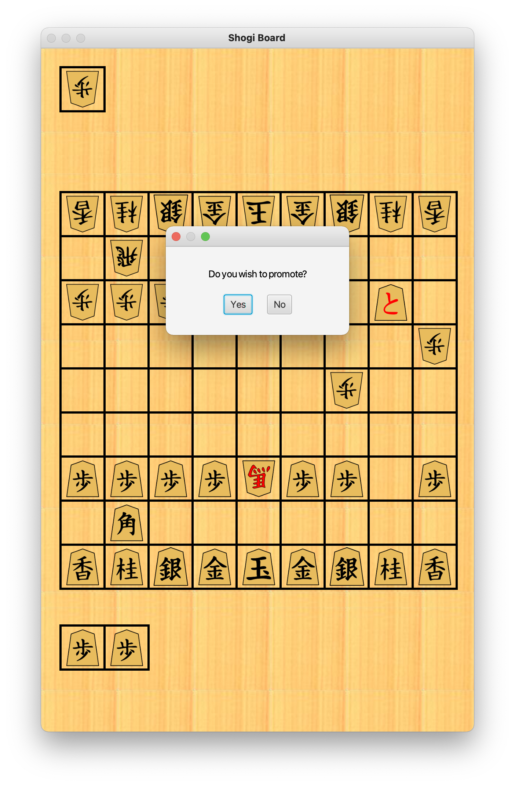

# Shogi Board
A simple model.board for moving shogi model.pieces according to the game rules. Implemented with Java 8, using Java FX for the graphic interface.

## Project Board
https://github.com/ntak1/ShogiBoard/projects/1

## Install
1. Find the svg2png.sh script and run it
2. Use InteliJ to build and run this project

## Technologies
* Maven for dependency management
* Google Guice as dependency injection framework
* JavaFX for UI

## Stuff to think about
* Dependency Injection or Factories?
* Best practices for DI
* How to make the model.board resizable?
* How to decouple Game logic from JavaFX?

## Screen Shots

## Resources
https://www.pavel.cool/java/JavaFX8-Guice-Integration/
